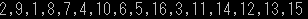

# 問2 配列・乱数
1から16までの数字をシャッフルし、列挙するプログラムを作成する。

## main.c

```C
#include <stdio.h>
#include <stdlib.h>
#include <time.h>

int main(void)
{
    int min,max,num;
    min = 1;
    max = 16;
    num = max-min+1;

    int i,k,array[num];

    srand((unsigned int)time(NULL));

    for(i=0; i<num; i++)
    {
        do
        {
            array[i] = rand()%max + min;
            for(k=0; k<i; k++)
            {
                if(array[i] == array[k])
                {
                    break;
                }
            }
        } while (i != k);
    }

    for(i=0; i<num; i++)
    {
        if(i<num-1)
        {
            printf("%d,", array[i]);
        }
        else
        {
            printf("%d\n", array[i]);
        }
    }

    return 0;
}
```
---
## 出力結果

[](./image/result.png)

---
- [問1へ](https://github.com/Kouji-Tanaka/B4_Programming1 "Kouji-Tanaka/B4_Programming1")
- [問3へ](https://github.com/Kouji-Tanaka/B4_Programming3 "Kouji-Tanaka/B4_Programming3")
- [問4へ](https://github.com/Kouji-Tanaka/B4_Programming4 "Kouji-Tanaka/B4_Programming4")
- [問5へ](https://github.com/Kouji-Tanaka/B4_Programming5 "Kouji-Tanaka/B4_Programming5")
- [問6へ](https://github.com/Kouji-Tanaka/B4_Programming6 "Kouji-Tanaka/B4_Programming6")

<div>
    <a href="#">
        [Topへ]
    </a>
</div>
